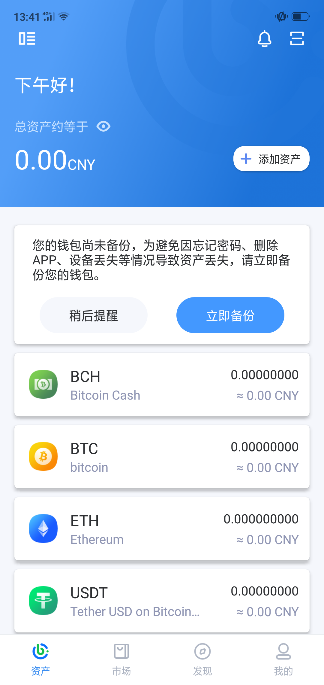
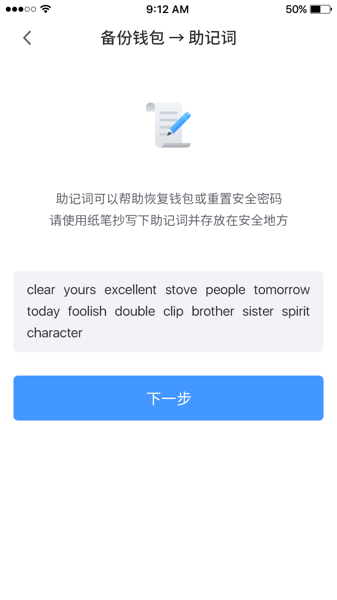

3.2 安全备份（非常重要）
----------------------------

为什么一定要备份？
>>>>>>>>>>>>>>>>>>>>>>>

私钥（助记词/Keystore）是数字资产所有权、使用权的“唯一”证明，任何人获得后都可以随意掌控、盗取钱包内的所有资产。所以在用户创建钱包后，一定要注意以下几点：

  1.立即备份！未备份的资产毫无安全性，手机丢失、钱包删除或忘记密码的情况下永远也无法找回资产
  
  2.尽可能采用物理介质备份，例如用笔抄在纸上，尽可能避免截屏或拍照存储在联网设备中，防止黑客盗取
  
  3.将备份后的私钥（助记词/Keystore）妥善保管，做好防盗防丢措施。

*助记词、Keystore是私钥的不同表现形式，按照一定的算法得出，帮助用户记忆复杂的私钥*
*忘记密码后，可以通过备份信息重新导入的方式重置密码*

如何备份助记词？
>>>>>>>>>>>>>>>>>>>>>>>

- 创建钱包后，在“资产”主页面点击“立即备份”

- 授权验证后将助记词抄写在物理介质上

- 验证助记词

- 至此，助记词备份完成，请妥善保管并做好防盗防丢措施。

.. image:: ../_static/zh-CN2.0/cn2018200030204.png
    :width: 320px
    :height: 675px
    :scale: 100%
    :align: center
