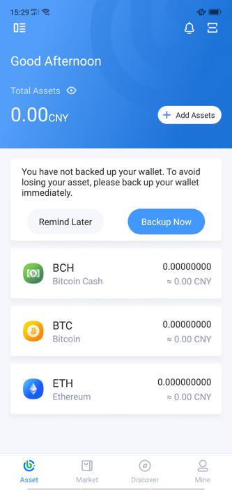
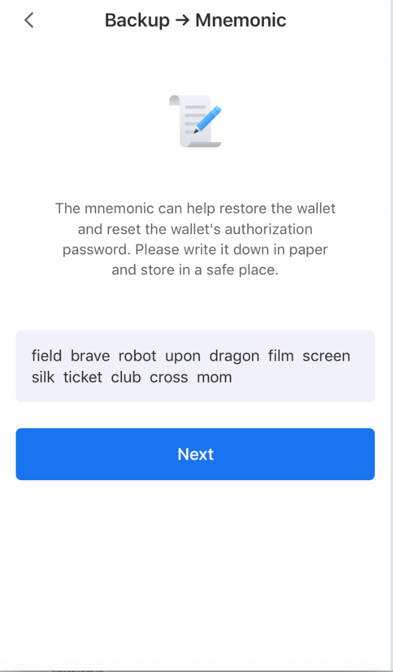
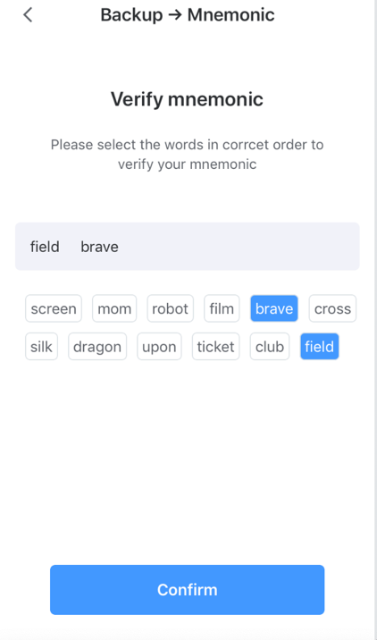
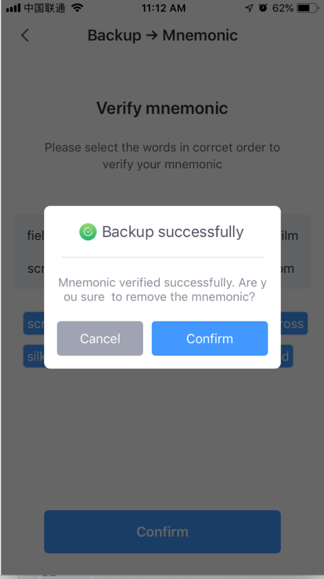

Backup mnemonic / Keystore
--------------------------------

Why must I back up?
>>>>>>>>>>>>>>>>>>>>>>>>>>>

The private key (Keystore) is the "unique" proof of the ownership and use of digital assets. Anyone can control all the assets in the wallet after they have obtained it.  So please be attach importance to the following points after creating the wallet,

1. Back up now! Unbacked assets are not secure, and assets can never be recovered if the phone is lost, the wallet is deleted, or the password is forgotten.

2. Use physical medium backup as much as possible, for example, copy it on paper, avoid screen capture or photo storage in networked devices, and prevent hackers from stealing.

3. Keep the backed up private key (mnemonic/Keystore) in a safe place and take anti-theft and anti-lost measures.

*Mnemonic phrase and keystore is a different form of private key to help users remember complex private keys according to a certain algorithm*

*You can reset the password by re-importing the backup information once forgetting the password*

How to back up mnemonics?
>>>>>>>>>>>>>>>>>>>>>>>>>>>>>>>>>>

- Click “Backup Now” on the “Asset” main page after creating the wallet,

- Copy the mnemonic phrase with the physical medium after authorization

- Verify the mnemonic phrasei

- Now, the backup of the mnemonic is completed, please keep it safe and take anti-theft and anti-lost measures.

