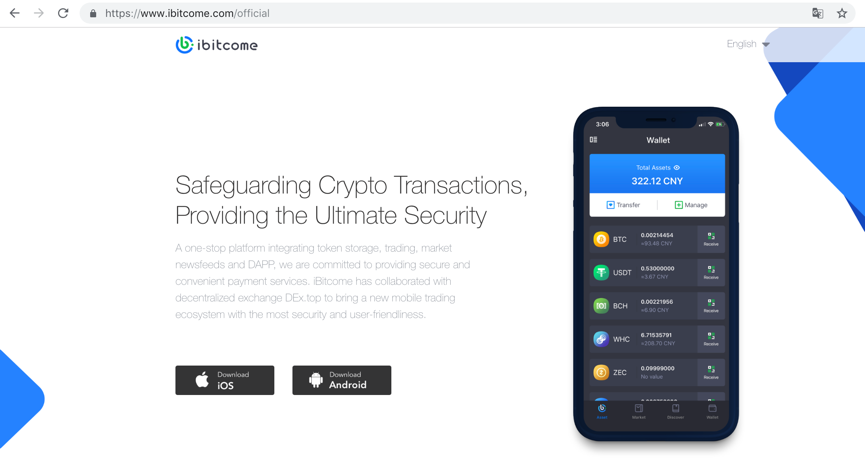
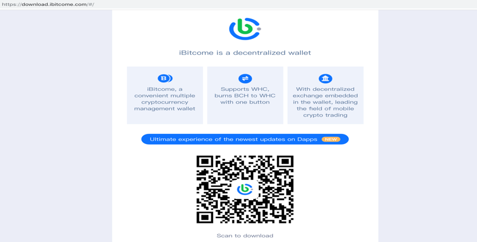

Download and Install
------------------------------

1.Download iBitcome on the official website https://www.ibitcome.com

2.Log in to the official download website https://download.ibitcome.com, then click or scan QR code to download

3.Other ways for installing

For Android: Search” iBitcome” on Google Play 
(Don't use a rooted phone and deep cleanup to delete phone files as it maybe delete important files in the Android phone.)

For IOS: Search” iBitcome” in Appstore 
(Don't open iCloud at will, because some important information will most likely be synced to iCloud or recorded in a memo, such as mnemonic screen capture)

