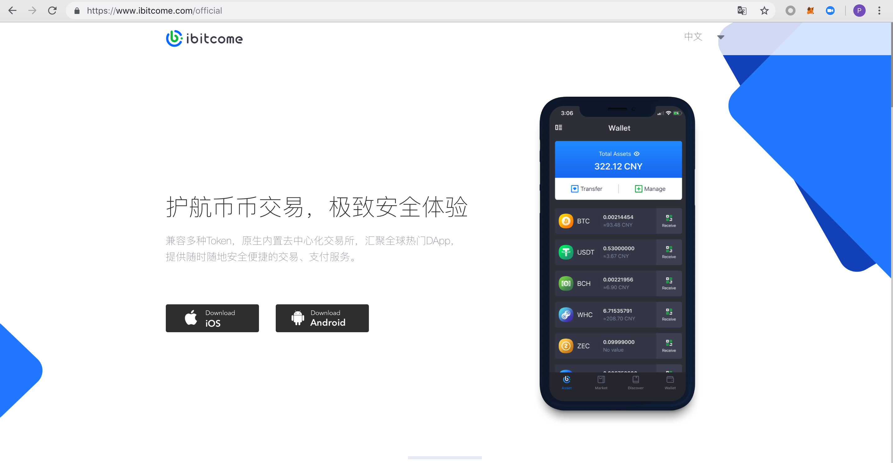
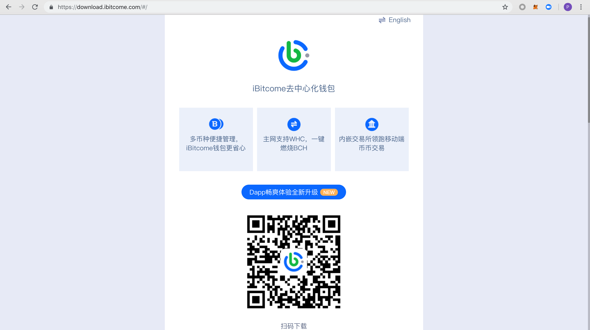

3.1安全下载与安装
------------------

1.通过官方网站`https://www.ibitcome.com <https://www.ibitcome.com>`_ 的推荐方式下载正版iBitcome钱包

2.登陆官方下载网址 `https://download.ibitcome.com <https://download.ibitcome.com>`_ 点击“立即体”或扫描二维码下载

3.其他方式：

安卓用户：在 Google Play 中搜索iBitcome下载安装。
（不要使用 Root 过后的手机, 同时不要随便使用深度清理来删除手机文件, 有些 Android 手机的深度清理会删除手机中一些重要文件）

苹果用户：在Appstore中搜索iBitcome下载安装（需要登陆海外Apple ID）。
（不要随意开启 iCloud 云备份; 因为如果你使用的错误备份方式,很可能会被同步到 iCloud 上, 例如将助记词截屏存储, 或者记录到备忘录里）

