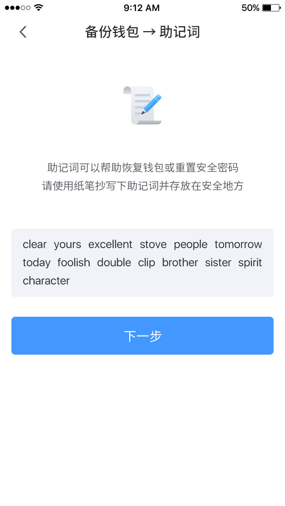

3.3 语言、法币显示设置
--------------------------

在“我的”页面点击“设置中心”

.. image:: ../_static/zh-CN2.0/cn2018200030201.png
    :width: 320px
    :height: 675px
    :scale: 100%
    :align: center

选择“法币显示（语言切换）”并点击“确认”完成设置

