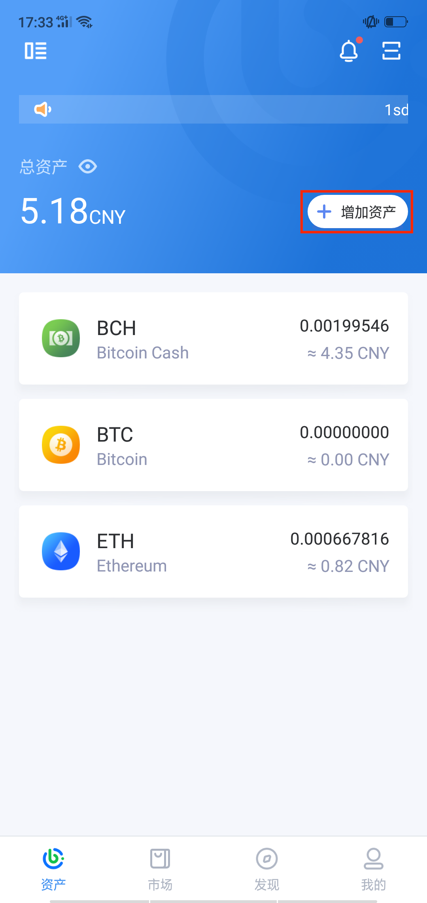
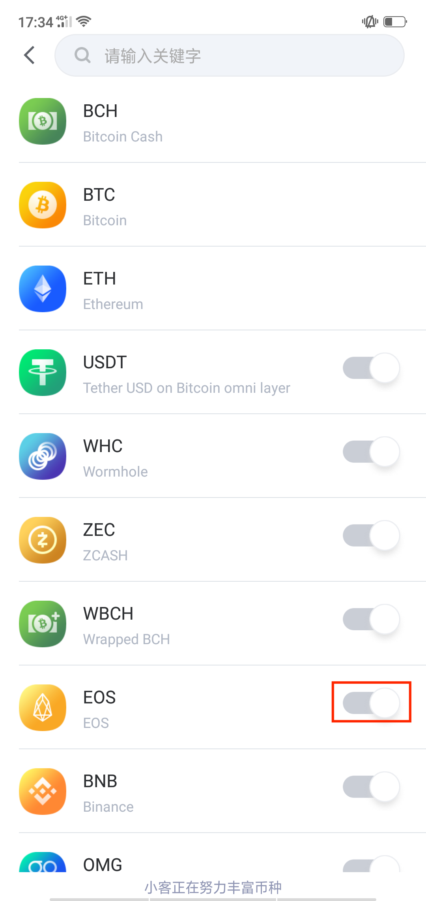
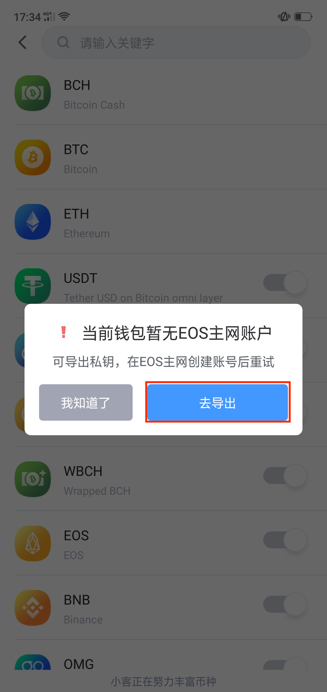
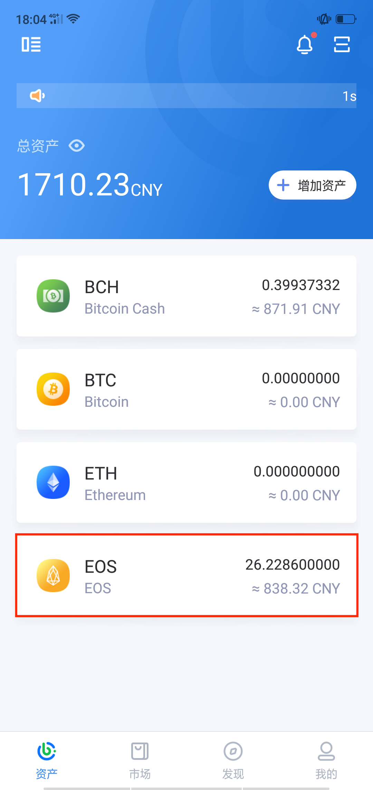
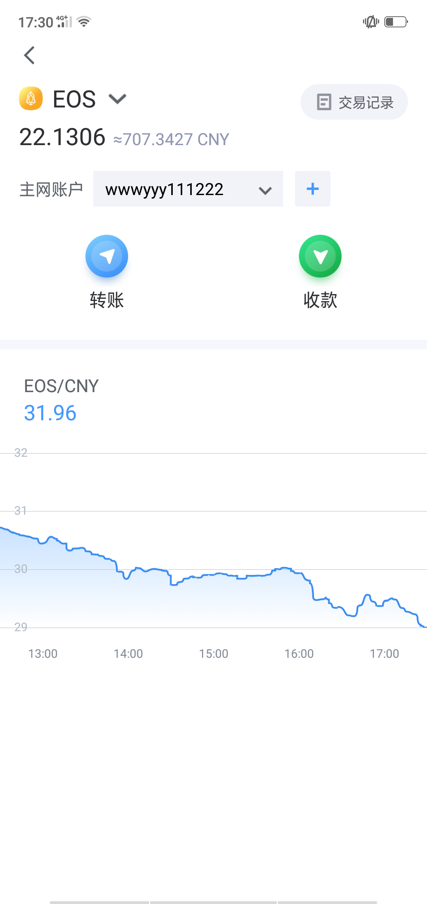

EOS 账户类型包括 12 位数的普通账户和小于 12 位数的高级账户两种。

EOS 采用账户体系，并且引入抵押和带宽模式。普通 EOS 账户名由 12 位字符组成，这相当于钱包的地址，用户在 EOS 中的所有操作都基于账户名，包括转账。

EOS 用户需要采用抵押和租赁资源的方式来获得网络使用权，资源包括 RAM 内存、CPU 带宽和 NET 带宽。所以，用户在创建 EOS 账户的时候，就需要花费一定数量的 EOS 来购买内存和带宽。

如何创建EOS账户？
------------------------

iBitcome钱包现阶段支持EOS账户的导入，如需创建新的EOS账户需要使用导出的私钥在EOS主网创建，则钱包内的EOS账户信息会自动同步。具体步骤如下：

- 在“资产”页点击“添加资产”，添加EOS

- 导出EOS私钥，去主网创建账户后，钱包内EOS账户即与主网同步。

- 创建成功后，即可进行 EOS转账和收款。

