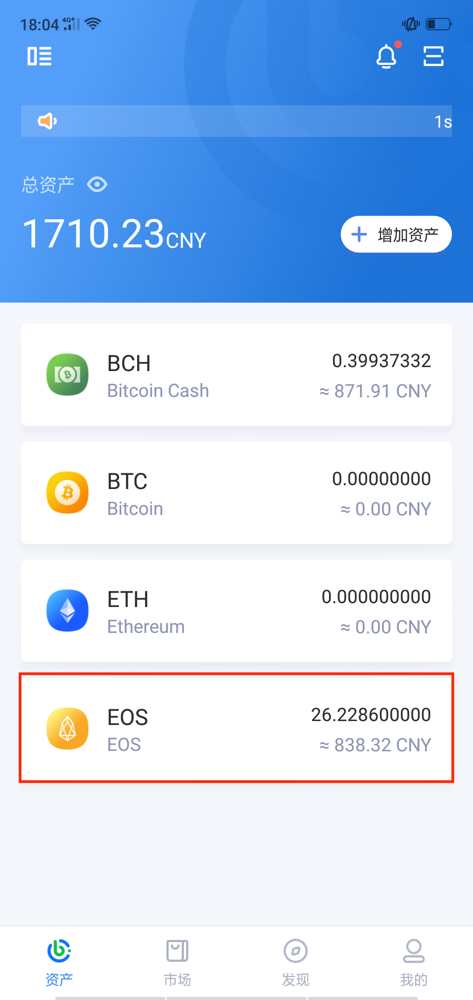
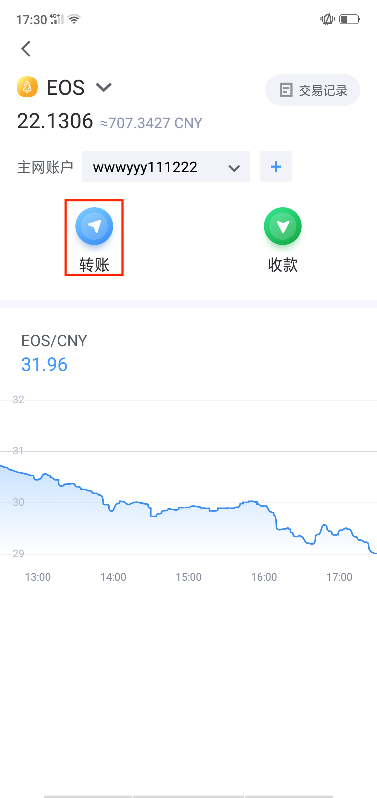
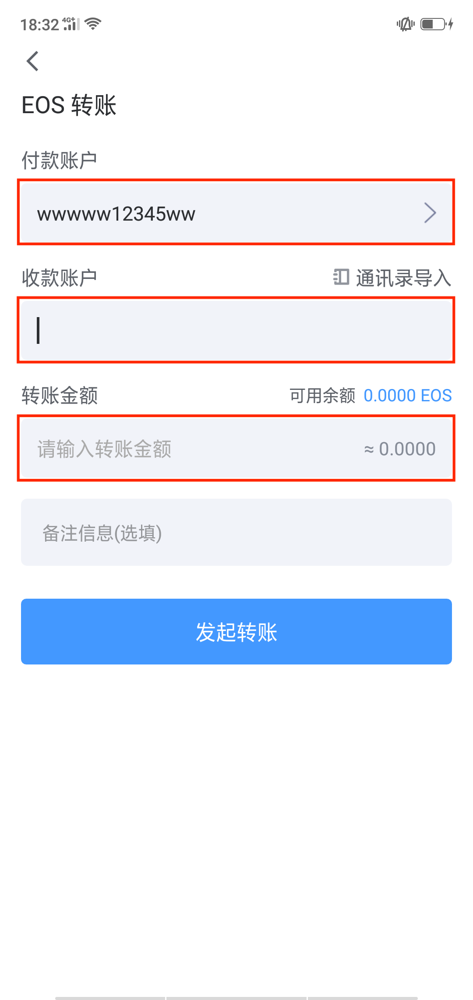
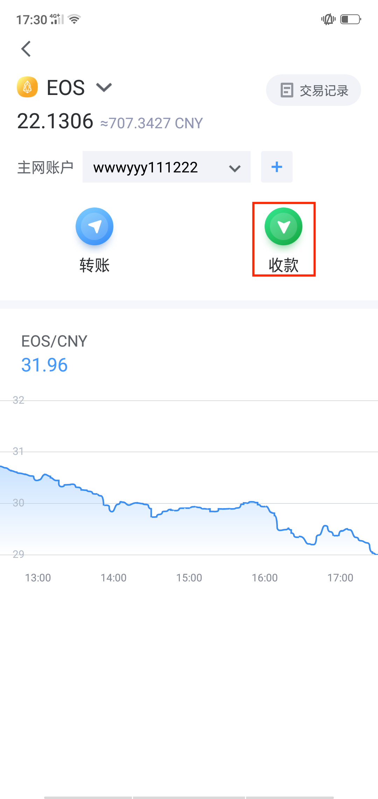
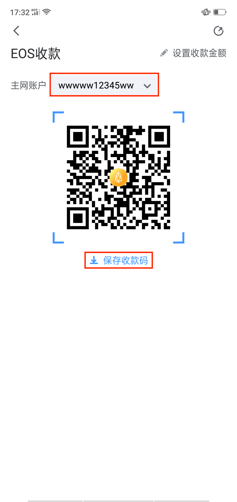

EOS转账收款
======================

转账
----------------------

- 在“资产”页面选择EOS，点击转账

- 选择付款账户、12位收款账户及金额

- 输入密码验证身份，确认交易后完成转账

Tips

EOS 转账不需要支付矿工费，但会消耗 RAM、CPU 和 NET。如果转账时 RAM，CPU 和 NET 超过 100%，则转账失败

收款
----------------

- 将 12 位 EOS 钱包账户名或收款二维码提供给对方，等待 EOS 到账

