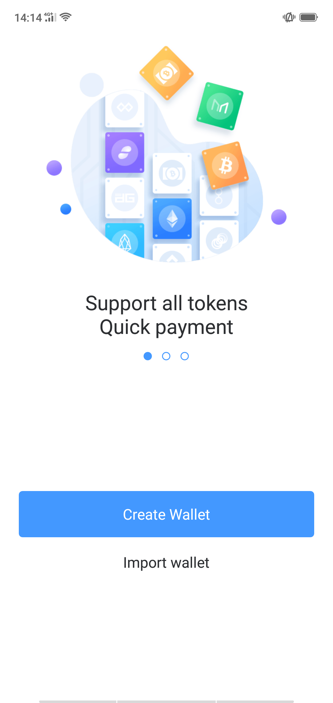
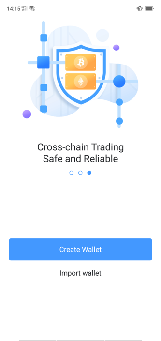
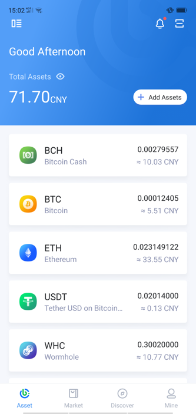
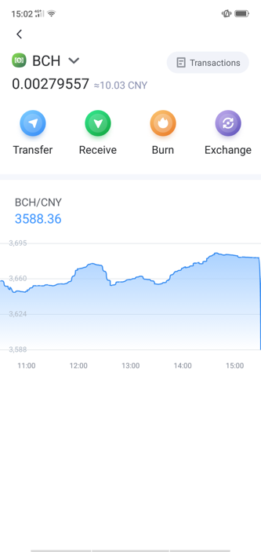
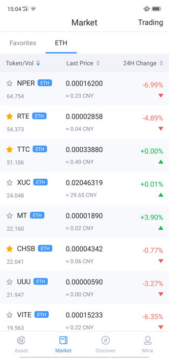
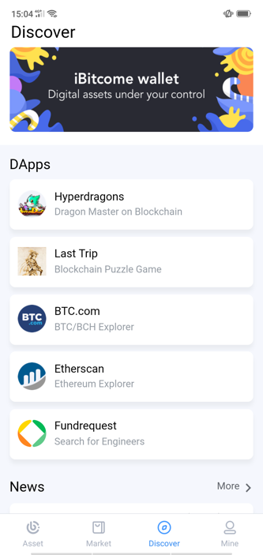
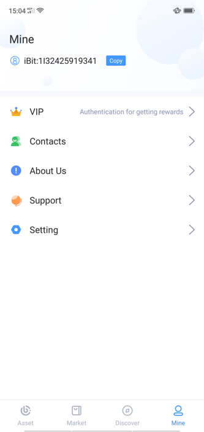

IBitcome Function Brie
==============================

Manage Wallet (in the upper left corner of the main page)
-------------------------------------------------------------

Create wallet

Import wallet Import private key/mnemonic/keystore into iBitcome

Switch wallet Multi-wallet management

Rename Wallet Personalize your own wallet name

Set Password Change your wallet password

Export private key Export wallet (single address) private key / keystore to backup

Assets
---------------

Send| Receive

Transaction Record View record for each transaction

Add Assets Search multiple tokens in one click, add to “Management” as you like

Gateway Exchange WBCH and BCH can be exchanged in real-time, more information on cross-chain gateway transaction

BCH Burning BCH burning generates WHC (more details on "What is WHC")

Market
--------------

Quotes View, market trends, market orders, recent transactions, etc.
Trading, mobile transactions through native embedding decentralized exchange DEx.top 

Discover
----------------

Activity entrance Update latest activity in real-time

DApp There are global popular DAPPs such as assets, games, tools, etc. with rich scene and function experience

Information Push the latest Industry news

Mine
-----------

VIP Submit member information to enjoy more services and event rewards

Contact Transfer address commonly used for easy management

About US Update version and contact information

Assistant FAQ 

Setting language(Chinese/English) and Currency 

