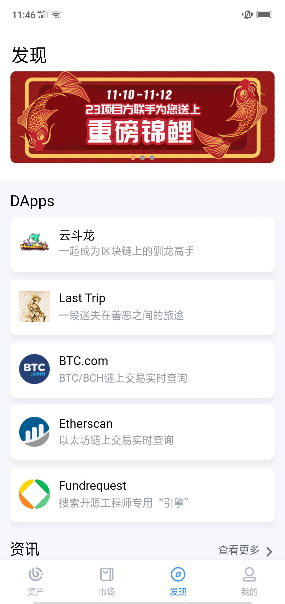

iBitcome功能简述
======================

钱包管理
----------

在主界面（首页）中有如下功能

创建钱包 

导入钱包 将其他钱包的私钥/助记词/keystore导入iBitcome

切换钱包 多钱包管理

钱包更名 本地个性化钱包名称

密码设置 更改钱包密码

导出私钥 将钱包（单地址）私钥/keystore导出备份

资产
----------

转账收款 

交易记录 查看各个币种的收发币记录

添加资产 一键搜索多币种，随心添加管理

网关兑换 BCH与WBCH的实时兑换，详见跨链网关交易
BCH燃烧 BCH燃烧生成WHC（详见“什么是虫洞WHC”）

市场
----------

行情查看 行情走势、市场订单、最近成交等信息一键查看

币币交易 原生内嵌去中心化交易所DEx.top，移动端交易全面掌控

发现
----------

活动入口 最新活动动态实时更新

DApp    资产、游戏、工具应用接入，丰富的移动应用场景

资讯     行业讯息，热点聚焦，精彩纷呈

我的
----------

会员中心 提交会员信息尊享更多服务和活动奖励

联系人   常用转账地址便捷管理

关于我们 版本信息、更新检测与联系信息

钱包助理 常见问题Q&A 

设置     中/英语言切换、法币显示设置

