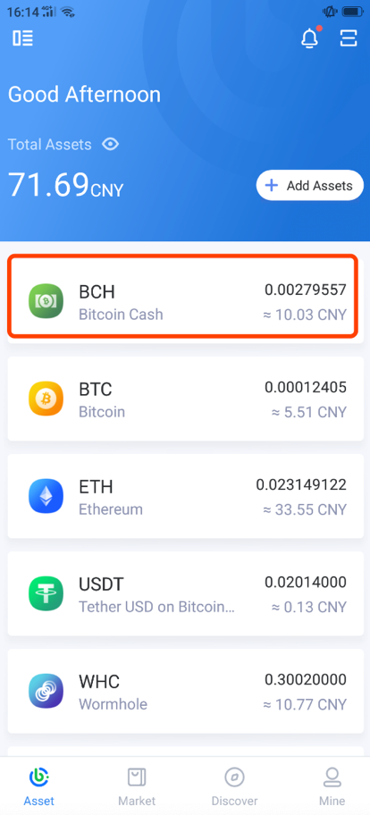
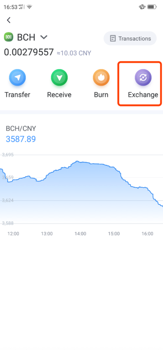
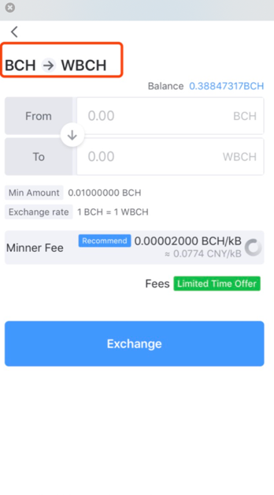
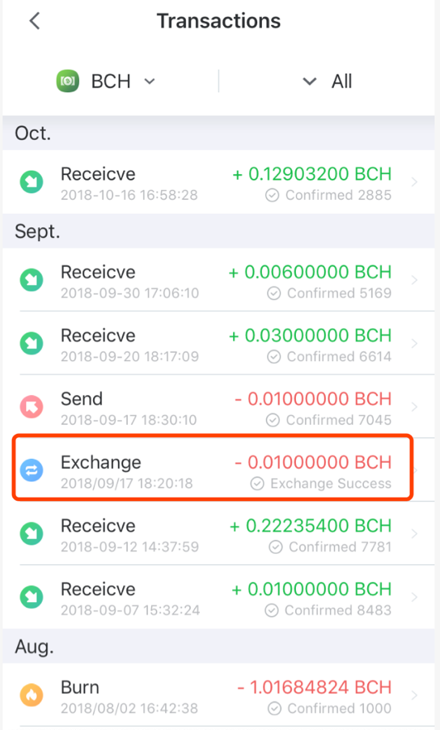
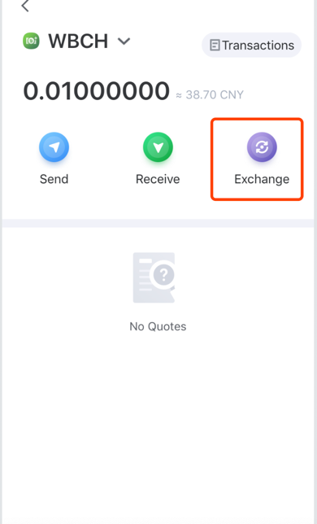
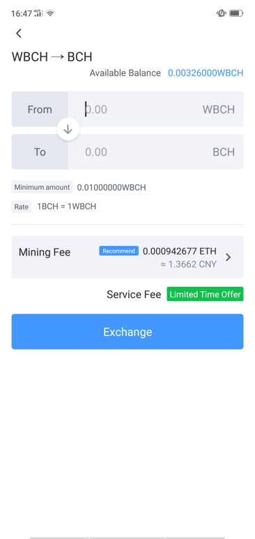

Exchange WBCH with BCH
-----------------------------

- Select BCH on the “Assets“ to enter the exchange page;

- Click "Exchange" and set the amount, mining fee

- Authorization for exchanging

- Exchange records and progress can be viewed in the transaction records

- Similarly, WBCH can also be exchanged for BCH in this way

