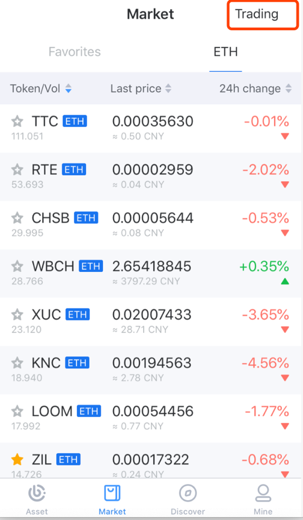
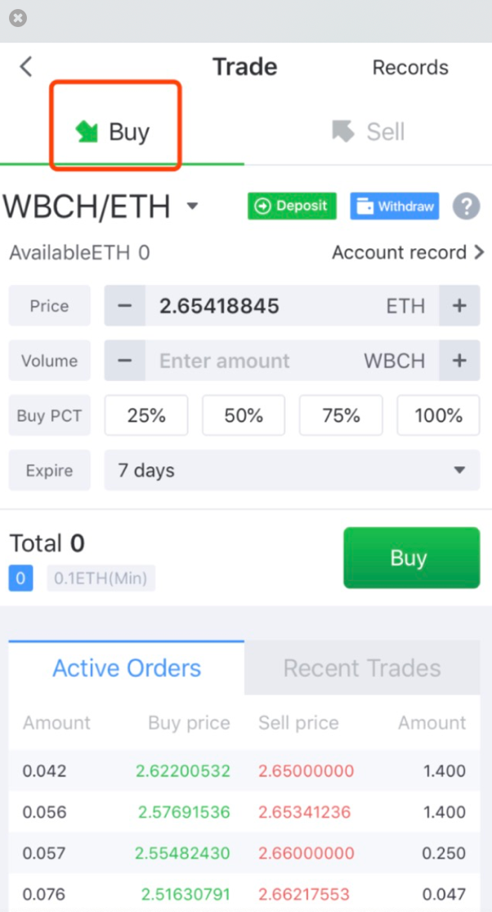
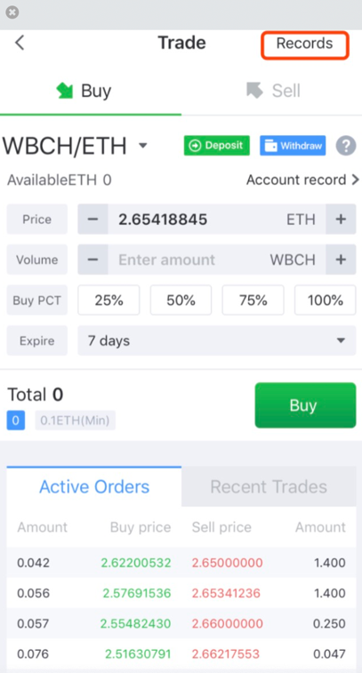
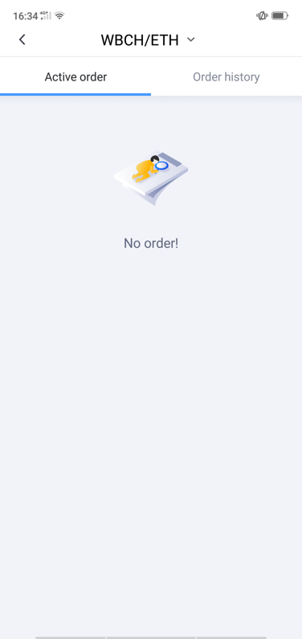

Pending Order on Exchange
--------------------------------

- Click on “Trading” on the “Market” page and enter authorization password to log in to the exchange

- Select the “Buy or Sell”. Set the transaction unit price, quantity, and expiration time and click it to confirm the transaction.

- Click on “Orders” to view complete order history

