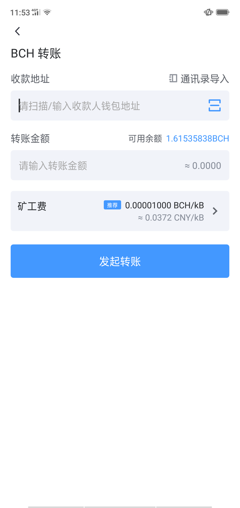

5.1 转账
---------------------

在“资产”页面点选想要转账的币种

.. image:: ../_static/zh-CN2.0/cn2018200050101.png
    :width: 320px
    :height: 675px
    :scale: 100%
    :align: center

点击“转账”进入转账页面

复制/扫码填充收款地址，设定金额、矿工费

授权验证并确认
