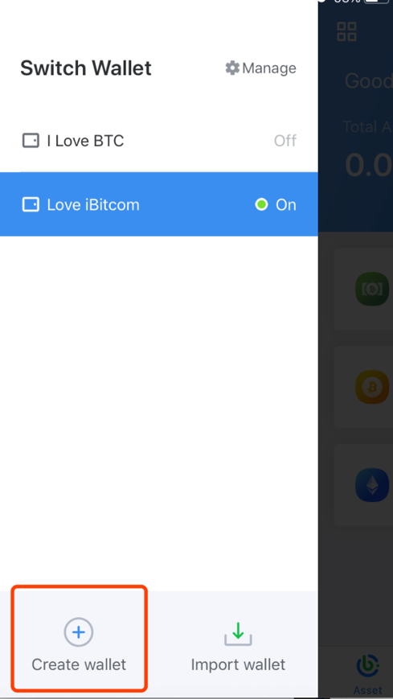
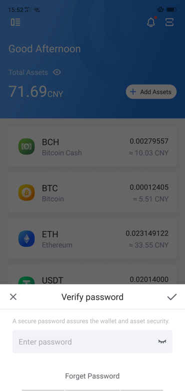

Create Wallet
--------------------

- Click “Manage” on the wallet home

.. image:: ../_static/en2.0/en2018200040201.png
    :width: 320px
    :height: 675px
    :scale: 100%
    :align: center

- Click “Create Wallet”

- Enter authorization password

**Tips: In order to protect the security of the assets, please be sure to back up!**

