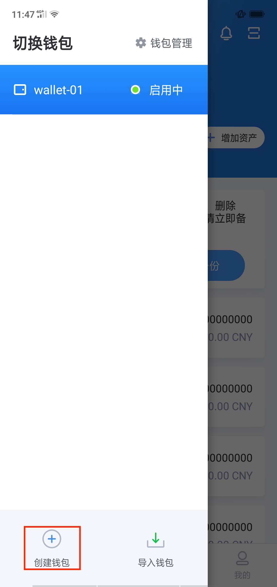

4.2 创建钱包
---------------

- 在钱包首页点击“钱包管理功能键

.. image:: ../_static/zh-CN2.0/cn2018200040201.png
    :width: 320px
    :height: 675px
    :scale: 100%
    :align: center

- 点击“创建钱包”

- 输入授权密码授权，完成创建

**温馨提示：为了保障资产安全，请一定要备份！**

