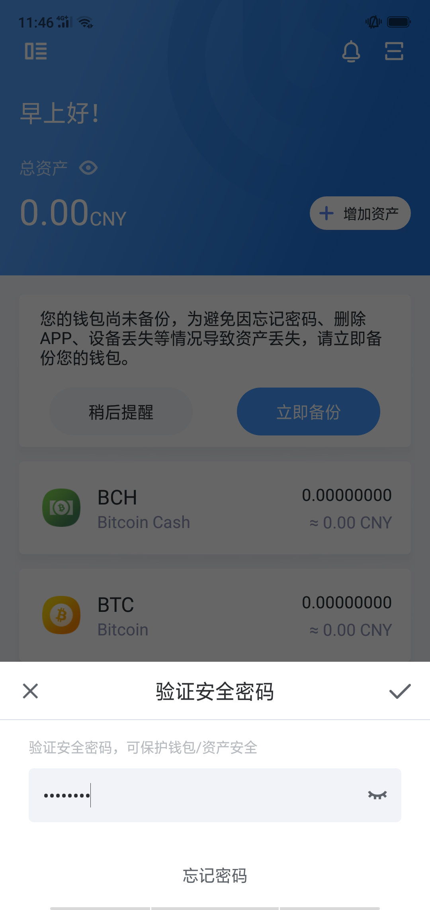
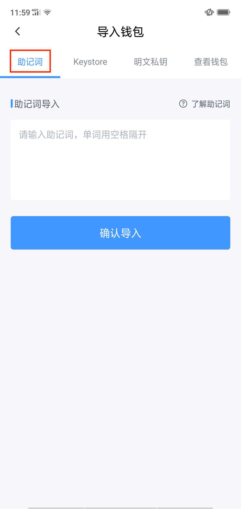
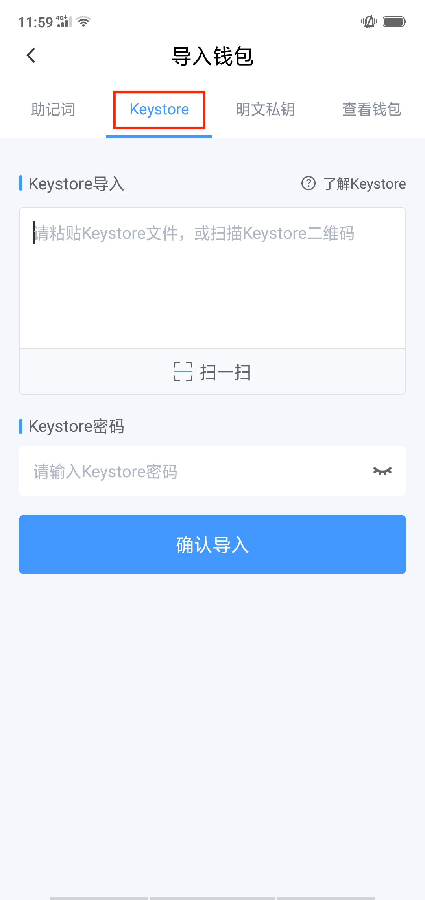
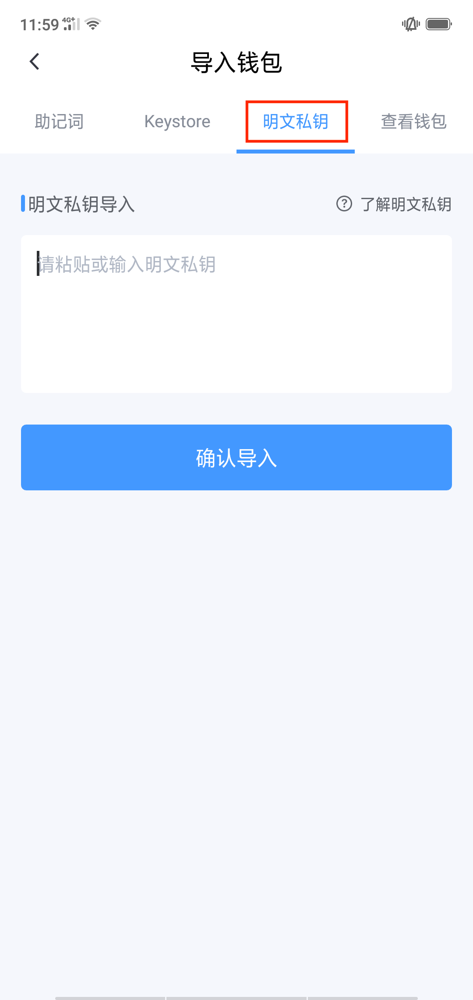
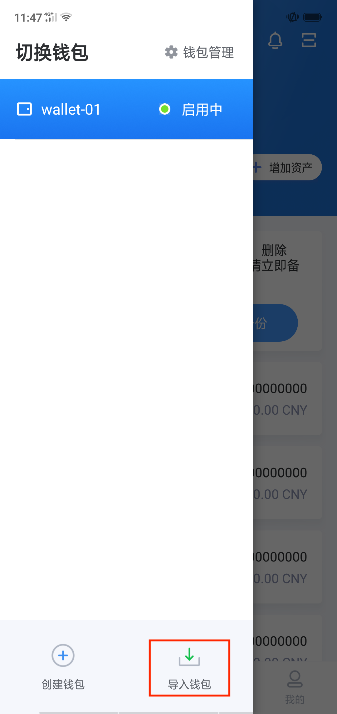
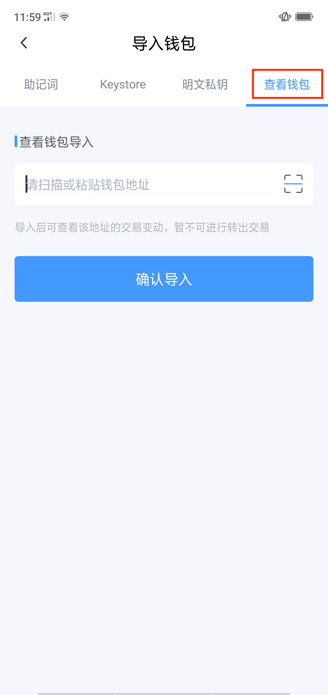

将其他钱包导入iBitcome
--------------------------------

- 在钱包首页点击“钱包管理功能键”

- 点击“导入钱包”

- 输入密码验证身份

- iBitcome支持三种方式导入

a.助记词
     
输入助记词（用空格隔开）

b.Keystore

粘贴/输入（扫描）Keystore文件（二维码），输入原Keystore密码

c.明文私钥

粘贴/输入明文私钥

导入“观察钱包”

- 点击“导入钱包”

- 点击“查看钱包”，粘贴（扫描）观察钱包的地址，完成导入

**温馨提示：“观察钱包”可查看交易记录、地址余额，不支持发起转账**

