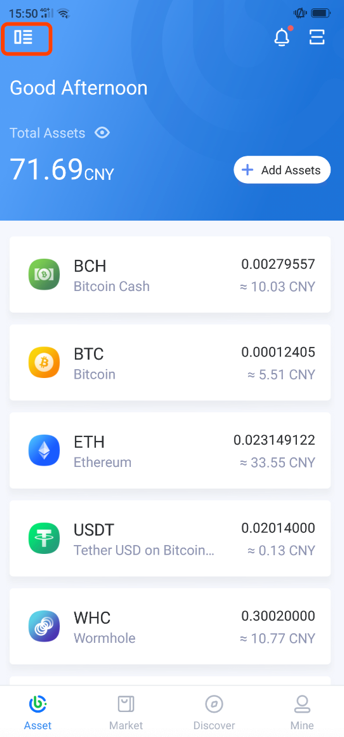
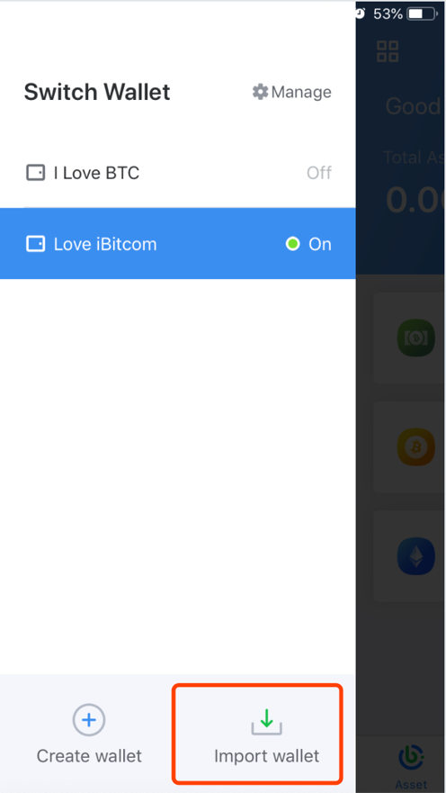
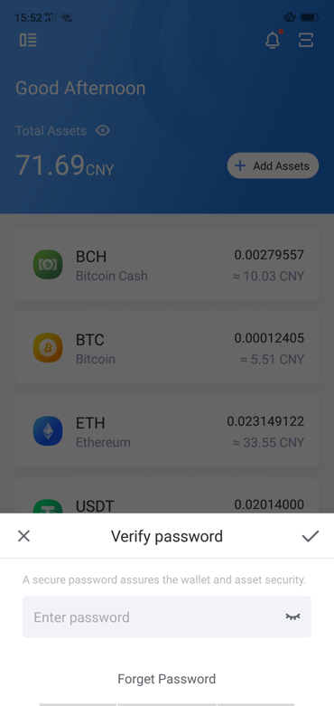
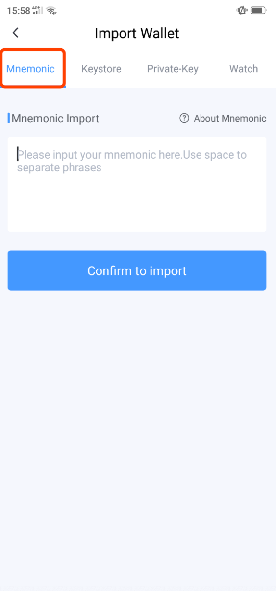
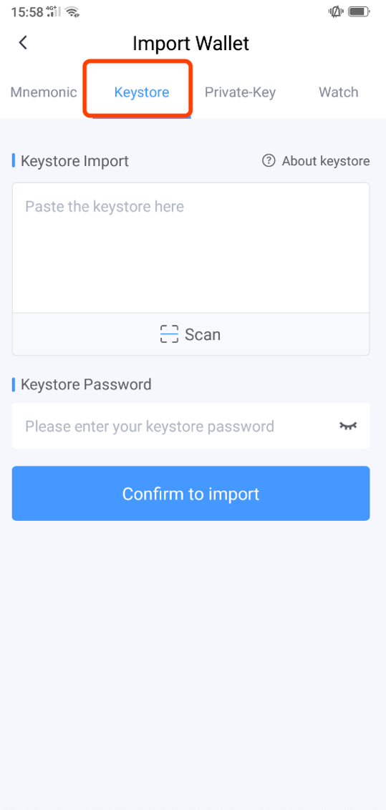
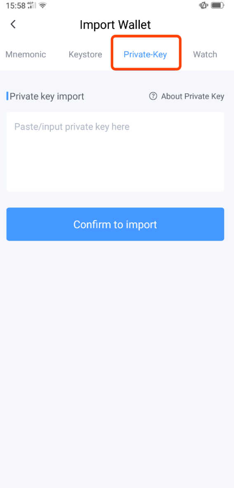
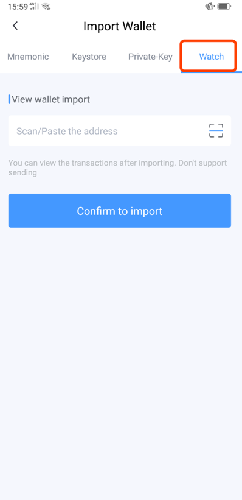

Import other wallets into iBitcome
------------------------------------------

- Click “ Manage“ on the wallet homepage

- Click “Import wallet“

- Enter authorization password

**Tips: In order to protect the security of the assets, please be sure to back up!**

- iBitcome supports three ways to import

a.Mnemonic
     
Enter Mnemonics (separated by spaces)

b.Keystore

Paste/enter the keystore file and enter the original Keystore password.

c.Private key

Paste/enter plaintext private key

导入“观察钱包”

- Import "Watch Wallet"

- Click “Watch ”, and paste the address of the watch wallet

**Tips: Watch Wallet is just way to observe your transaction records, check balance.  Don’t support transfer**
