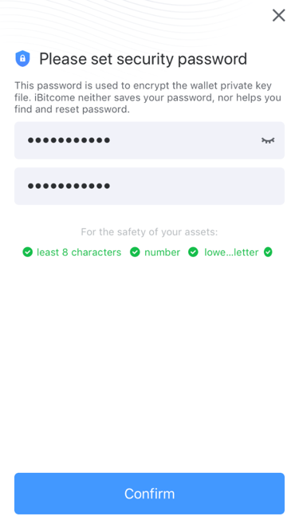
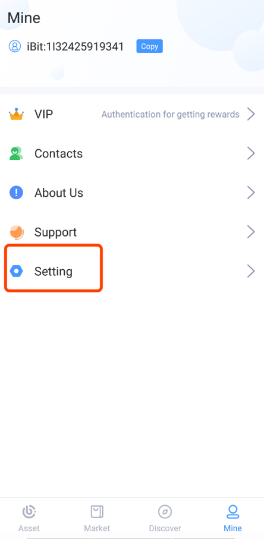
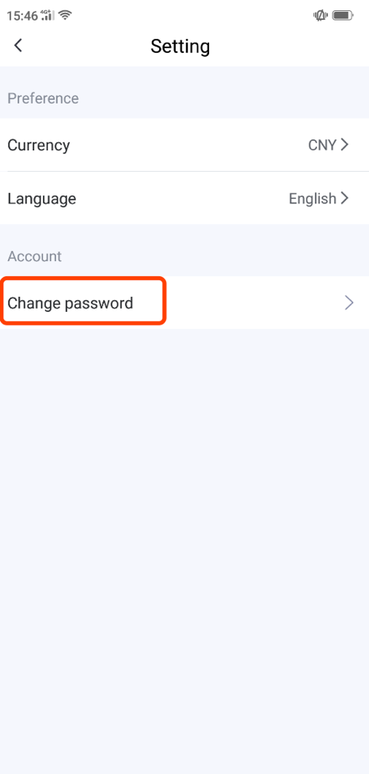

Password management
-------------------------

Setting password
>>>>>>>>>>>>>>>>>>>>>>>>

When you first create/import an iBitcome wallet, you need to set a password with a certain level of complexity to protect the security of assets, transactions, and privacy. For the sake of security, the password should be a combination of upper/lowercase letters and numbers containing at least 8 characters.

Change password
>>>>>>>>>>>>>>>>>>>>>>>>

Click “Settings” on the “Mine” page

Click “Setting” and “Change password”

What if I forget my security password?
>>>>>>>>>>>>>>>>>>>>>>>>>>>>>>>>>>>>>>>>>>>

iBitcome, as a decentralized application based on blockchain, does not store your security password. So please keep it safe as it cannot be retrieved once forgetting. If this occurs， you can only reset the password in the following ways.

- Uninstall iBitcome, re-import the wallet and reset the security password

**Warning: Unbacked wallets cannot be retrieved and you will lose all assets in your wallet, so please remember to back up the Mnemonic phrase**

