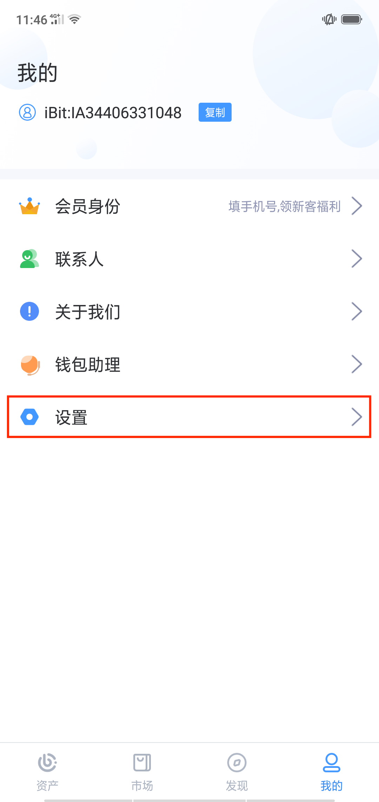

4.1 密码管理
-------------------

密码设置
>>>>>>>>>>>>>>

初次创建/导入iBitcome钱包时，需要设置一定复杂程度的密码，来保护资产、交易、隐私的安全。为了安全起见，密码必须是包含至少8位字符的大/小写字母和数字的组合

更改密码
>>>>>>>>>>>>>>>

在钱包首页点击“钱包管理功能键”

点击“管理钱包”，选择需要更改密码的钱包

点击“修改密码”，即可对原密码进行修改

忘记密码
>>>>>>>>>>>>>>>>>

iBitcome是一款去中心化钱包，不存储您的安全密码，如密码遗忘，无法通过官方及客服找回。但可以通过以下方式重置密码

- 删除忘记密码的钱包，而后重新导入，并设置新的密码。

**重要提示：未备份的钱包无法找回，忘记密码将失去钱包内的所有资产**

