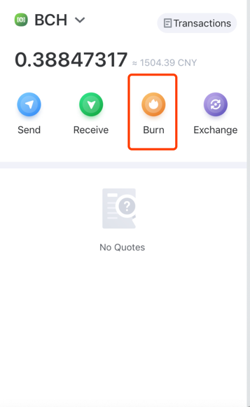
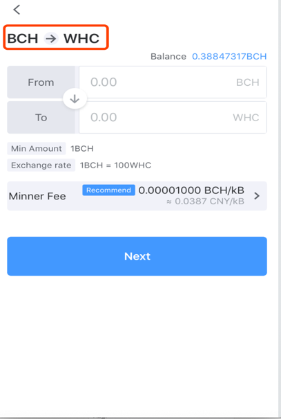
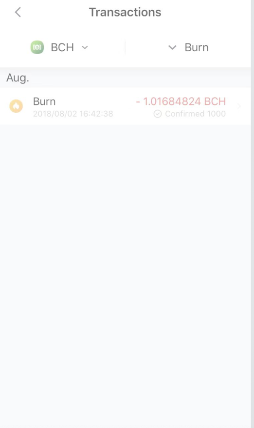

BCH burning to generate WHC
----------------------------------

- Select BCH on the “Assets“ to enter the exchange page;

.. image:: ../_static/en2.0/en2018200080101.png
    :width: 320px
    :height: 675px
    :scale: 100%
    :align: center

- Click "Burning" and set the amount of burning and save the WHC address

- Authorization for burning

- Burning records and progress can be viewed in the transaction records

