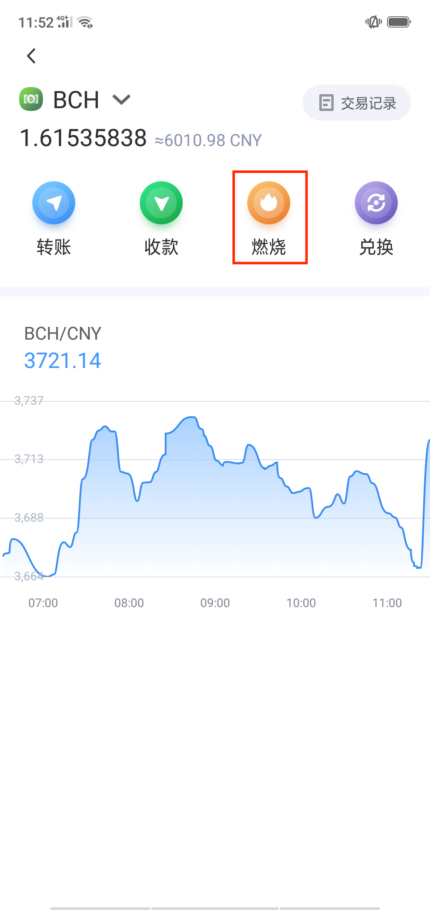
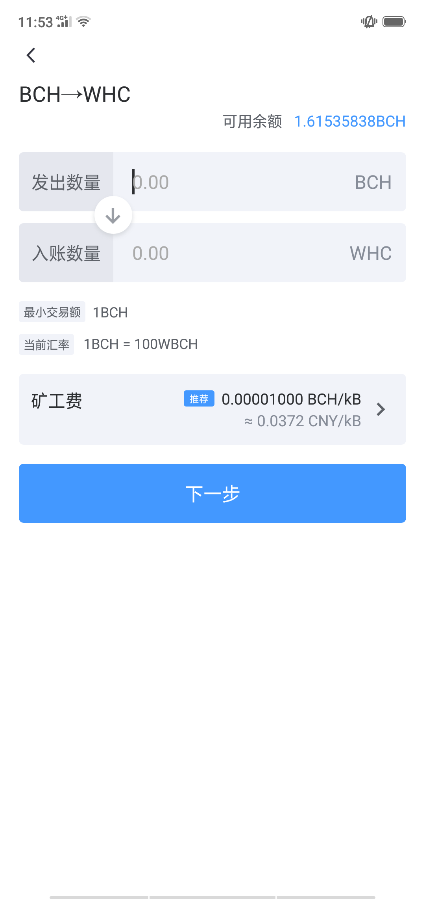

8.1 BCH燃烧生成WHC
---------------------------

- 在“资产”页面选择BCH进入操作界面

.. image:: ../_static/zh-CN2.0/cn2018200080101.png
    :width: 320px
    :height: 675px
    :scale: 100%
    :align: center

- 点击“燃烧”，设置燃烧数量及保存WHC的地址

- 授权认证开始燃烧

- 燃烧记录及进度可在交易记录中筛选查看

